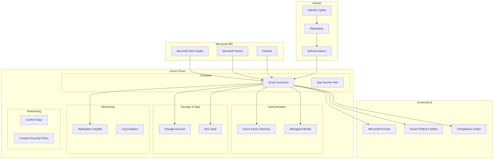
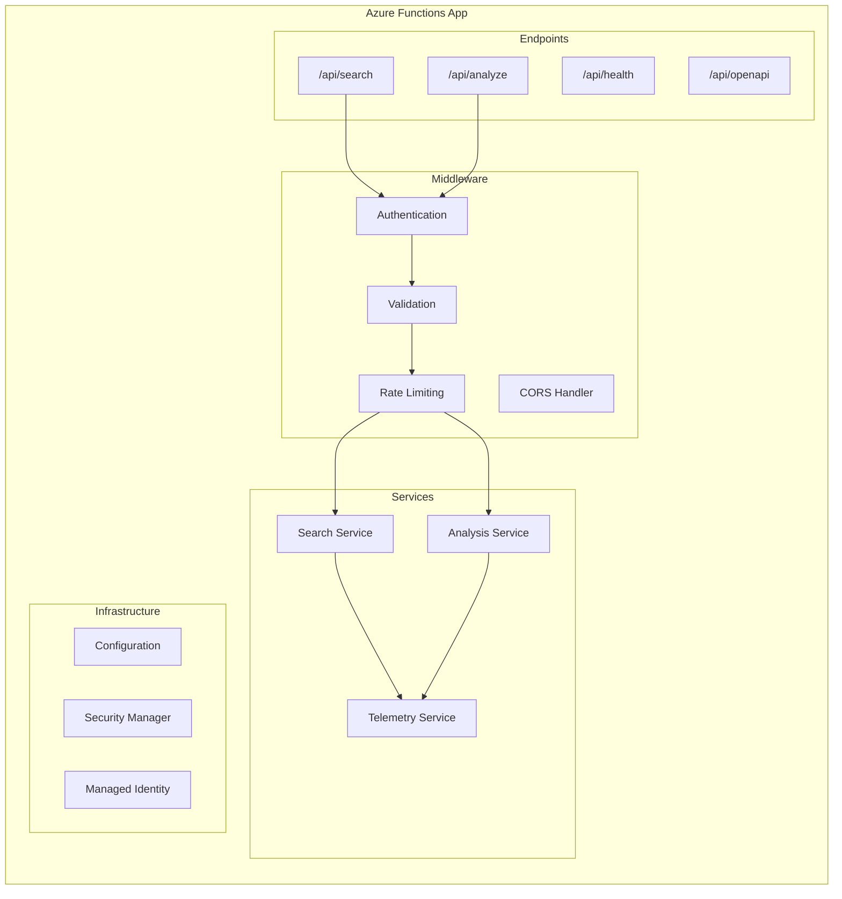
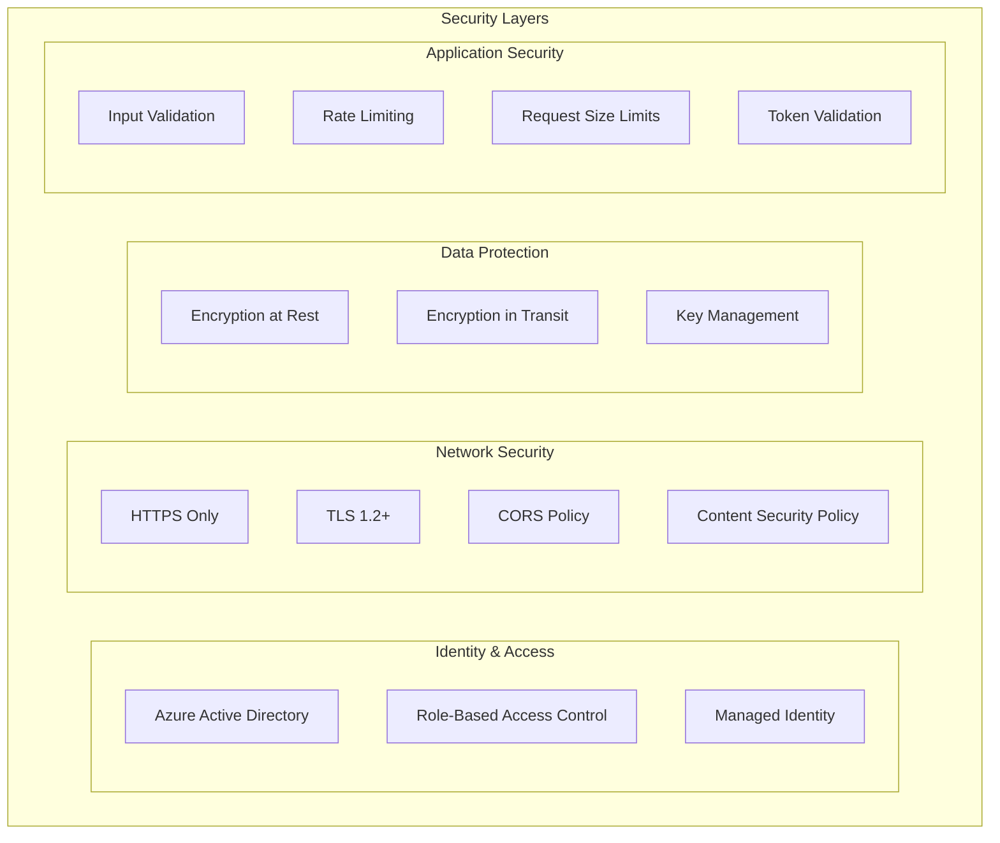
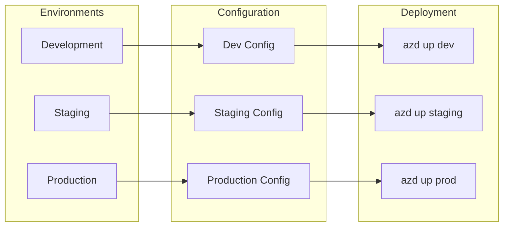

# Architecture Overview

## System Architecture

The Microsoft 365 Copilot Plugin follows a modern, cloud-native architecture built on Azure services and best practices for security, scalability, and maintainability.

## Component Architecture

### 1. Plugin Layer

#### OpenAPI Specification

- **Purpose**: Defines the API contract for Copilot integration
- **Format**: OpenAPI 3.0.1 with Microsoft-specific annotations
- **Features**:
  - Copilot-compatible operation definitions
  - Security schemes (Bearer token)
  - Comprehensive schemas and validation
  - Error handling specifications

#### Plugin Manifest

- **Purpose**: Describes plugin capabilities to Microsoft 365 Copilot
- **Format**: JSON with Microsoft plugin schema
- **Features**:
  - Function definitions and descriptions
  - Authentication requirements
  - Conversation starters
  - Localization support

### 2. API Layer (Azure Functions)

#### Core Components

**Main Application (`main.py`)**

- FastAPI-based Azure Functions app
- Request routing and middleware
- Error handling and logging
- Health monitoring

**Security Middleware**

- Bearer token validation
- Request size validation
- Input sanitization
- CORS policy enforcement

**Business Services**

- **SearchService**: Handles data search operations
- **AnalysisService**: Performs content analysis
- **TelemetryService**: Tracks usage and performance

### 3. Data & Storage Layer

#### Azure Storage Account

- **Purpose**: Azure Functions runtime storage
- **Configuration**:
  - Standard_LRS for cost optimization
  - HTTPS-only traffic
  - TLS 1.2 minimum
  - No public blob access

#### Azure Key Vault

- **Purpose**: Secure secrets management
- **Features**:
  - RBAC authorization
  - Soft delete protection
  - Audit logging
  - Managed identity access

### 4. Monitoring & Observability

#### Application Insights

- **Purpose**: Application performance monitoring
- **Features**:
  - Custom event tracking
  - Request correlation
  - Exception monitoring
  - Dependency tracking
  - Performance metrics

#### Log Analytics Workspace

- **Purpose**: Centralized logging
- **Features**:
  - Structured logging
  - Query capabilities
  - Alert rules
  - Dashboard integration

### 5. Security Architecture

#### Security Features

**Authentication & Authorization**

- Azure AD integration for token validation
- Managed identity for resource access
- RBAC for fine-grained permissions
- Least privilege access principles

**Data Protection**

- Encryption at rest and in transit
- Secure key management via Key Vault
- No hardcoded credentials
- Secure configuration management

**Network Security**

- HTTPS enforcement
- CORS policy configuration
- Content Security Policy headers
- TLS 1.2 minimum requirement

**Application Security**

- Input validation and sanitization
- Rate limiting per client
- Request size limitations
- Comprehensive error handling

### 6. DevOps & CI/CD Architecture

```mermaid
graph LR
    subgraph "Development"
        Dev[Developer]
        VSCode[VS Code + Copilot]
        Local[Local Testing]
    end

    subgraph "Source Control"
        GitHub[GitHub Repository]
        PR[Pull Requests]
        Branch[Feature Branches]
    end

    subgraph "CI Pipeline"
        Lint[Linting & Formatting]
        Test[Unit Testing]
        Security[Security Scanning]
        Build[Build Artifacts]
    end

    subgraph "Validation"
        OpenAPIVal[OpenAPI Validation]
        PluginVal[Plugin Validation]
        Integration[Integration Tests]
    end

    subgraph "Deployment"
        AZD[Azure Developer CLI]
        Bicep[Infrastructure as Code]
        Functions[Function Deployment]
    end

    Dev --> VSCode
    VSCode --> Local
    Local --> GitHub
    GitHub --> PR
    PR --> Lint
    Lint --> Test
    Test --> Security
    Security --> Build
    Build --> OpenAPIVal
    OpenAPIVal --> PluginVal
    PluginVal --> Integration
    Integration --> AZD
    AZD --> Bicep
    Bicep --> Functions
```

## Deployment Architecture

### Infrastructure as Code (Bicep)

The infrastructure is defined using Azure Bicep templates that provision:

1. **Resource Group**: Logical container for all resources
2. **Storage Account**: Required for Azure Functions runtime
3. **App Service Plan**: Hosting plan for the Function App
4. **Function App**: Serverless compute with Python runtime
5. **Application Insights**: Telemetry and monitoring
6. **Key Vault**: Secure secrets storage
7. **Log Analytics**: Centralized logging
8. **Managed Identity**: Secure authentication
9. **Role Assignments**: RBAC permissions

### Environment Strategy

## Scalability & Performance

### Horizontal Scaling

- Azure Functions automatic scaling
- Consumption-based pricing model
- Event-driven architecture
- Stateless design

### Performance Optimization

- Connection pooling for external services
- Caching strategies for frequent operations
- Async/await patterns for I/O operations
- Optimized cold start performance

### Monitoring & Alerting

- Real-time performance metrics
- Automatic scaling triggers
- Custom alert rules
- Performance baseline tracking

## Governance & Compliance

### Microsoft Purview Integration

- Data classification and labeling
- Audit trail maintenance
- Compliance reporting
- Risk assessment

### Power Platform Governance

- DLP policy enforcement
- Connector approval workflows
- Usage monitoring and reporting
- Admin center integration

## Future Architecture Considerations

### Enhanced AI Capabilities

- Integration with Azure OpenAI Service
- Custom ML model deployment
- Cognitive Services integration
- Vector search capabilities

### Advanced Security

- Zero Trust architecture
- Conditional access policies
- Advanced threat protection
- Identity protection

### Multi-Region Deployment

- Geographic distribution
- Disaster recovery planning
- Data residency compliance
- Load balancing strategies

## Best Practices Implemented

1. **Security First**: Zero trust, defense in depth
2. **Observability**: Comprehensive monitoring and logging
3. **Automation**: Infrastructure as Code, CI/CD pipelines
4. **Scalability**: Serverless, event-driven architecture
5. **Maintainability**: Clean code, documentation, testing
6. **Compliance**: Governance, audit trails, data protection
