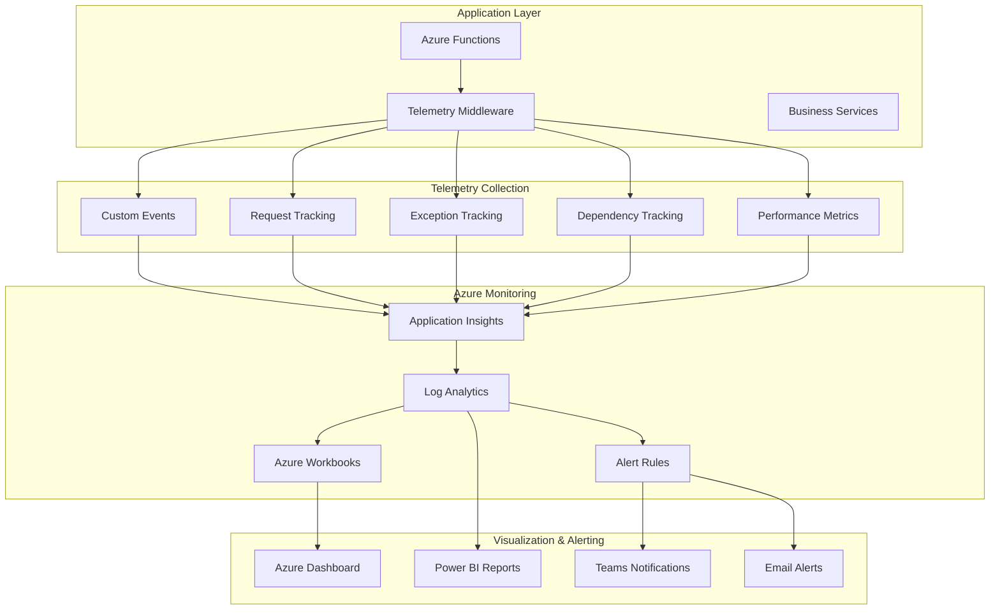

# Telemetry and Monitoring Guide

This guide covers the comprehensive telemetry and monitoring capabilities built into the Microsoft 365 Copilot Plugin.

## Overview

The plugin implements enterprise-grade telemetry using Azure Application Insights and follows observability best practices for production-ready applications.

## Architecture



## Telemetry Components

### 1. TelemetryManager Class

The core telemetry management class provides a unified interface for all telemetry operations.

#### Key Features

- **Centralized Configuration**: Single point of telemetry setup
- **Error Resilience**: Graceful degradation when telemetry fails
- **Correlation Context**: Request tracking across services
- **Performance Optimization**: Async operations and batching

#### Usage Example

```python
from src.telemetry import get_telemetry_manager, track_function

# Get global telemetry instance
telemetry = get_telemetry_manager()

# Track custom events
telemetry.track_event('user_search', {
    'query_length': len(query),
    'category': category
})

# Use decorator for automatic function tracking
@track_function(telemetry, "search_operation")
def search_data(query: str) -> Dict:
    # Function implementation
    return results
```

### 2. Event Tracking

#### Custom Events

Track business-specific events to understand user behavior and system usage.

**Search Events**

```python
telemetry.track_event('search_completed', {
    'query_length': 25,
    'category': 'documents',
    'result_count': 10,
    'user_id': 'user123'
}, {
    'duration_ms': 150.5,
    'relevance_score': 0.85
})
```

**Analysis Events**

```python
telemetry.track_event('analysis_completed', {
    'analysis_type': 'sentiment',
    'content_length': 500,
    'language': 'en-US'
}, {
    'duration_ms': 1200.0,
    'confidence_score': 0.92
})
```

**Error Events**

```python
telemetry.track_event('function_error', {
    'function_name': 'analyze_content',
    'error_type': 'ValidationError',
    'error_message': 'Content too long'
}, {
    'duration_ms': 50.0
})
```

### 3. Request Tracking

Automatically track HTTP requests with correlation IDs and performance metrics.

#### Request Correlation

Each request receives a unique correlation ID that follows the request through all components:

```python
correlation_context = telemetry.create_correlation_context()
# Returns: {
#   'request_id': 'uuid-4',
#   'timestamp': '2023-07-22T10:30:00Z',
#   'plugin_version': '1.0.0'
# }
```

#### Performance Tracking

```python
telemetry.track_request(
    name="search",
    url="https://plugin.azurewebsites.net/api/search",
    success=True,
    duration_ms=125.5,
    response_code=200,
    properties={
        'request_id': correlation_context['request_id'],
        'user_id': user_context['user_id'],
        'query_complexity': 'medium'
    }
)
```

### 4. Exception Tracking

Comprehensive exception tracking with contextual information.

```python
try:
    result = risky_operation()
except Exception as e:
    telemetry.track_exception(e, {
        'operation': 'data_processing',
        'user_id': user_id,
        'input_size': len(input_data),
        'retry_count': retry_count
    })
    raise
```

### 5. Dependency Tracking

Monitor external service calls and their performance.

```python
telemetry.track_dependency(
    name="database_query",
    dependency_type="SQL",
    target="sql-server.database.windows.net",
    success=True,
    duration_ms=45.2,
    properties={
        'query_type': 'SELECT',
        'table_name': 'documents',
        'row_count': 100
    }
)
```

### 6. Distributed Tracing

Implement distributed tracing for complex operations.

```python
# Start operation
span = telemetry.start_operation("complex_search_operation")

try:
    # Perform multiple sub-operations
    results = search_service.search(query)
    analyzed = analysis_service.analyze(results)
    
    # End operation successfully
    telemetry.end_operation(span, success=True)
    return analyzed
    
except Exception as e:
    # End operation with error
    telemetry.end_operation(span, success=False, error_message=str(e))
    raise
```

## Monitoring Dashboards

### 1. Application Performance Dashboard

Key metrics to monitor:

- **Request Volume**: Requests per minute/hour
- **Response Times**: P50, P95, P99 percentiles
- **Error Rates**: 4xx and 5xx error percentages
- **Availability**: Uptime percentage
- **Throughput**: Operations per second

### 2. Business Metrics Dashboard

Plugin-specific metrics:

- **Search Operations**: Query volume, success rate, average response time
- **Analysis Operations**: Analysis type distribution, processing time
- **User Engagement**: Active users, session duration, feature usage
- **Content Analysis**: Content types, languages, complexity distribution

### 3. Infrastructure Dashboard

System health metrics:

- **Function App Health**: CPU, Memory, Execution count
- **Storage Performance**: Read/write latency, transaction volume
- **Key Vault Access**: Secret retrieval frequency, access patterns
- **Network Performance**: Bandwidth usage, connection counts

## KQL Queries

### Application Insights Kusto Queries

#### Request Performance Analysis

```kusto
requests
| where timestamp > ago(24h)
| summarize 
    RequestCount = count(),
    AvgDuration = avg(duration),
    P95Duration = percentile(duration, 95)
    by bin(timestamp, 1h), name
| render timechart
```

#### Error Rate Analysis

```kusto
requests
| where timestamp > ago(24h)
| summarize 
    TotalRequests = count(),
    FailedRequests = countif(success == false),
    ErrorRate = (countif(success == false) * 100.0 / count())
    by bin(timestamp, 1h)
| render timechart
```

#### Custom Event Analysis

```kusto
customEvents
| where timestamp > ago(24h)
| where name == "search_completed"
| extend 
    QueryLength = toint(customDimensions.query_length),
    ResultCount = toint(customDimensions.result_count),
    Duration = toreal(customMeasurements.duration_ms)
| summarize 
    SearchCount = count(),
    AvgQueryLength = avg(QueryLength),
    AvgResultCount = avg(ResultCount),
    AvgDuration = avg(Duration)
    by bin(timestamp, 1h)
| render timechart
```

#### Exception Analysis

```kusto
exceptions
| where timestamp > ago(24h)
| summarize 
    ExceptionCount = count(),
    UniqueExceptions = dcount(type)
    by bin(timestamp, 1h), type
| render timechart
```

#### User Behavior Analysis

```kusto
customEvents
| where timestamp > ago(7d)
| where name in ("search_completed", "analysis_completed")
| extend UserId = tostring(customDimensions.user_id)
| summarize 
    EventCount = count(),
    UniqueUsers = dcount(UserId),
    EventsPerUser = count() / dcount(UserId)
    by name
```

## Alerting Strategy

### 1. Critical Alerts (Immediate Response)

- **Service Unavailable**: 100% error rate for 5+ minutes
- **High Error Rate**: >10% error rate for 10+ minutes
- **Performance Degradation**: P95 response time >5 seconds for 10+ minutes
- **Authentication Failures**: >50 auth failures in 5 minutes

### 2. Warning Alerts (Monitor Closely)

- **Increased Error Rate**: >5% error rate for 15+ minutes
- **Slow Response Times**: P95 response time >3 seconds for 15+ minutes
- **High Request Volume**: >1000% increase in request volume
- **Dependency Issues**: External service failures

### 3. Informational Alerts (Track Trends)

- **Usage Spikes**: Significant increase in user activity
- **Feature Adoption**: New feature usage patterns
- **Performance Trends**: Gradual performance changes
- **Cost Anomalies**: Unexpected cost increases

## Alert Configuration

### Azure Monitor Alert Rules

```json
{
  "name": "High Error Rate Alert",
  "description": "Alert when error rate exceeds 10% for 10 minutes",
  "criteria": {
    "allOf": [
      {
        "query": "requests | where timestamp > ago(10m) | summarize ErrorRate = (countif(success == false) * 100.0 / count())",
        "timeAggregation": "Average",
        "operator": "GreaterThan",
        "threshold": 10
      }
    ]
  },
  "actions": [
    {
      "actionGroupId": "/subscriptions/.../actionGroups/critical-alerts",
      "actionType": "ActionGroup"
    }
  ]
}
```

### Teams Integration

Configure Teams webhook for immediate notifications:

```yaml
# teams-webhook-config.yml
webhook_url: "https://outlook.office.com/webhook/..."
message_template: |
  **🚨 Plugin Alert: {{ alert_name }}**
  
  **Severity:** {{ severity }}
  **Time:** {{ timestamp }}
  **Description:** {{ description }}
  
  **Metrics:**
  - Error Rate: {{ error_rate }}%
  - Response Time: {{ response_time }}ms
  - Request Count: {{ request_count }}
  
  [View in Azure Portal]({{ portal_link }})
```

## Performance Optimization

### 1. Telemetry Configuration

Optimize telemetry for performance:

```python
# Configure sampling for high-volume scenarios
telemetry_config = {
    'sampling_percentage': 10,  # Sample 10% of requests
    'enable_adaptive_sampling': True,
    'max_telemetry_items_per_second': 100,
    'buffer_timeout_seconds': 30
}
```

### 2. Batch Operations

Use batch operations for efficiency:

```python
# Batch multiple events
events = [
    {'name': 'event1', 'properties': {...}},
    {'name': 'event2', 'properties': {...}},
    # ... more events
]

telemetry.track_events_batch(events)
```

### 3. Async Telemetry

Implement non-blocking telemetry:

```python
import asyncio

async def track_async_event(name: str, properties: dict):
    """Track event asynchronously without blocking main thread"""
    await asyncio.create_task(
        telemetry.track_event_async(name, properties)
    )
```

## Data Retention and Privacy

### 1. Data Retention Policies

Configure appropriate retention periods:

- **Performance Data**: 90 days
- **Error Logs**: 365 days
- **Audit Logs**: 7 years (compliance requirement)
- **User Behavior**: 30 days (privacy consideration)

### 2. Data Privacy

Implement privacy-by-design:

```python
def sanitize_telemetry_data(properties: dict) -> dict:
    """Remove or hash sensitive data before tracking"""
    sanitized = properties.copy()
    
    # Remove sensitive fields
    sensitive_fields = ['email', 'phone', 'ssn']
    for field in sensitive_fields:
        sanitized.pop(field, None)
    
    # Hash identifiable information
    if 'user_id' in sanitized:
        sanitized['user_id'] = hash_user_id(sanitized['user_id'])
    
    return sanitized
```

### 3. GDPR Compliance

Implement data subject rights:

- **Data Export**: Provide user telemetry data export
- **Data Deletion**: Purge user data on request
- **Data Minimization**: Collect only necessary telemetry
- **Consent Management**: Track user consent for telemetry

## Troubleshooting

### Common Telemetry Issues

1. **Missing Telemetry Data**
   - Check Application Insights connection string
   - Verify network connectivity
   - Review sampling configuration

2. **High Telemetry Costs**
   - Implement adaptive sampling
   - Reduce custom event frequency
   - Optimize data payload size

3. **Performance Impact**
   - Use async telemetry operations
   - Implement telemetry batching
   - Monitor telemetry overhead

### Debug Commands

```bash
# Check Application Insights connectivity
az monitor app-insights component show --app myapp --resource-group myrg

# View recent telemetry
az monitor app-insights query --app myapp --analytics-query "requests | limit 10"

# Test telemetry endpoint
curl -X POST "https://dc.applicationinsights.azure.com/v2/track" \
  -H "Content-Type: application/json" \
  -d '{"name": "test_event", "time": "2023-07-22T10:30:00Z"}'
```

## Best Practices Summary

1. **Comprehensive Coverage**: Track all critical operations
2. **Meaningful Context**: Include relevant properties and measurements
3. **Performance Conscious**: Minimize telemetry overhead
4. **Privacy Aware**: Sanitize sensitive data
5. **Actionable Insights**: Focus on metrics that drive decisions
6. **Proactive Monitoring**: Set up alerts before issues occur
7. **Regular Review**: Continuously improve telemetry strategy
